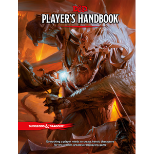

# The DMPOWER Project


 This program is Designed for Dungeons & Dragons 5th Edition Official. The data is from:
 
 | [Player's Handbook](http://dnd.wizards.com/products/tabletop-games/rpg-products/rpg_playershandbook) | [Dungeon Master's Guide](http://dnd.wizards.com/products/tabletop-games/rpg-products/dungeon-masters-guide) | [Sword Coast Adventurer's Guide](http://dnd.wizards.com/products/tabletop-games/rpg-products/sc-adventurers-guide) |
 | --- | --- | --- |
 | [](http://dnd.wizards.com/products/tabletop-games/rpg-products/rpg_playershandbook) | [](http://dnd.wizards.com/products/tabletop-games/rpg-products/rpg_playershandbook) | [](http://dnd.wizards.com/products/tabletop-games/rpg-products/rpg_playershandbook) |
 
My original plan was to create a helpful program for me as a Dungeon Master. Something to aid in tabletop play and prep. I've included tools that I felt the need for personally. Anything that could save me minutes of precious game time and assist with continuity if possible. DMPOWER is essentially the program I've always wanted but could never find. 


 * Best suited for Dungeon Masters.  
 * Tools marked  are the ones I found myself using the most, give them a shot.
 * All rolls and generator randomness done with [Mersenne Twister](https://en.wikipedia.org/wiki/Mersenne_Twister), arguably the best randomizer out there.
 * Uncrashable. I've taken measures to make sure the user cannot accidentally crash the program. Go crazy testing. Bad input will result in 'Invalid choice, try again.'

### Many Useful Tools


        
1. **CHARACTER RECORDS** 

    _Build and Manage Player Characters_
    
    * Walk through the prompts to create a full character _by the book_
        * Save + Load
        * For Levels 1 to 20
        * All options from the official 5e books : Dungeon Master's Guide, Player's Handbook, and Sword Coast Adventurer's Guide.  
        * All Classes
        * All Archetype Paths
        * All Races
        * All Feats 
        * All Skills 
        * All Proficiencies 
        * All Backgrounds
        * Starting Stat Options : Rolling Low (3d6) or High (4d6 drop lowest) Powered or Standard Recommended Starting Stats (15,14,13,12,10,8), or Custom Entry
        * Level Up! function : Prompts new Class Path options, feats, stats increases, etc
        * Limitations : No Multiclassing, No Picking Spells (does show slots available), No Picking Equipment


2. **REWARD LOOT HELPER** 

    _Magic Item / Reward Roller (by the DM Guide)_
    
    *  Scroll and Spellbook Generators : Randomized
    *  Loot Rollers : by the book. Try out the Roll Horde Loot option for some fun.


3. **Additional Tools**  

    * Party Experience Calculator. Total up session or encounter experience (based on CR's overcame) and split it with the party. Pretty straightforward, could use some UI improvements but it is fully functional.
    *  Name Generator. 7732 names from Kismet's list randomized. Great for planning and on the fly naming.   
    * Insult Generator. NSFW. For when you just need to anger the PC's or antagonize them with a baddie. I just threw this in for fun. It takes two lists from files and randomly combines words, easily adapted to new words by editing the settings file.
    * And more. 

#### How do you run this?  

_DMPOWER is a Command Line Interface program_

* Linux. From Command Line -
    * c++11 dependencies
        * ````sudo apt-get update````
        * ````sudo apt-get install build-essential````
    * clone from github
        * ````git clone https://github.com/bytePro17124/DMPOWER````
    * move to directory
        * ````cd DMPOWER````
	* compile 
		* ````make````
	* run 
		* ````./dmpower````
	* or compile and run 
		* ````make run````
* Windows. Should work the same as Linux with [Cygwin](https://www.cygwin.com/) or [WSL](https://msdn.microsoft.com/commandline/wsl/about)
* MacOS. Untested but should work about the same.


#### Problems? Or want to help?
  
* Feel free to let me know about issues. Feel free to correct stuff. 

#### About

* All Code by [**_Matthew Jay Early_**](https://twitter.com/matthewjayearly) 
* [](https://www.paypal.com/cgi-bin/webscr?cmd=_s-xclick&hosted_button_id=982RBXVEKD9Z8) I love to work on this but don't always have time. Consider a friendly gesture, nice words and alpha testing go a long way if you want to help but not donate. 
* Email : [matthewjearly@gmail.com](mailto::matthewjearly@gmail.com) 
* Tweet : [**_@matthewjayearly_**](https://twitter.com/matthewjayearly) 

#### ToDo
1. build interfaced version : _in progress this summer_ 
    * see other branches for more information
2. improve tools
